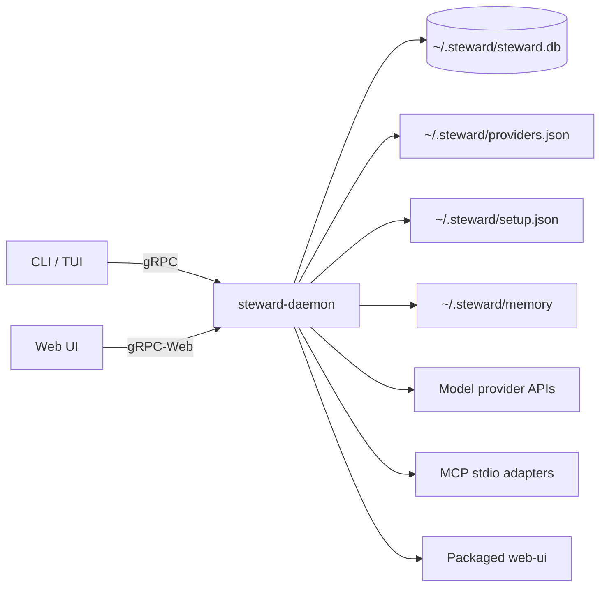

# Steward Architecture

Steward is a compact local agent runtime. The CLI/TUI and Web UI are clients; the daemon owns persistence, model calls, tool policy, workflows, and Web static-file serving.

## Topology



Both RPC and Web listeners bind to loopback. Running `steward` loads setup, starts the daemon if needed, waits for the Web UI port, prints the local Web address, and opens the terminal interface.

## Workspace Boundaries

| Path | Responsibility |
| --- | --- |
| `crates/core` | Generated protobuf types, storage-root resolution, provider catalog/profile config |
| `crates/daemon` | RPC service, SQLite stores, model client adapters, agent loop, workflow engine, tools, MCP, Web serving |
| `crates/cli` | Setup wizard, daemon autostart, CLI commands, interactive TUI, import/export commands |
| `crates/knowledge` | Local memory, graph retrieval, nightly consolidation |
| `proto` | gRPC and gRPC-Web contract |
| `web-ui` | Static-exported operator console |
| `npm` | npm launcher that downloads and caches the release zip under `~/.steward/runtime` |
| `scripts` | Windows packaging, install, and uninstall scripts |

## Data Ownership

Mutable state defaults to `~/.steward`; `STEWARD_HOME` overrides it for tests and portable runs.

```text
~/.steward/
├── setup.json
├── providers.json
├── steward.db
├── logs/
├── memory/
└── runtime/
```

`setup.json` stores local service choices such as the Web port. `providers.json` stores provider metadata and API-key environment variable names, never secret values. SQLite stores workflow runs/events, workflow definitions, node outputs, chat sessions/messages, tool registry data, MCP metadata, audit records, and knowledge indexes.

Export/import operates on the whole Steward home so sessions, providers, workflows, memory, and local configuration move together.

## Model Providers And Chat

Provider profiles are selected by id and protocol:

- OpenAI-compatible Chat Completions
- Anthropic Messages
- Gemini `generateContent`

The provider catalog is a starter list, not a hard-coded wall. Operators can add custom endpoints through the CLI or Web UI. The active profile drives both terminal chat and Web chat. Chat sessions are persisted and can be resumed, listed, or deleted.

## Workflow Execution

Steward supports two workflow paths:

1. Legacy phase workflows for approval-gated run state.
2. Saved DAG definitions built in the Web visual/JSON editor.

Saved definitions are validated before persistence: node ids must be unique, node instructions must be present, edges must reference known nodes, duplicate edges are rejected, and cycles are rejected. Runtime execution topologically orders the graph, sends each node through the same agent/model path as chat, stores node outputs, and skips already completed nodes during resume.

## Tools And Skills

Built-in tools and MCP-discovered tools share the same registry, risk, approval, and audit path. Skill bundles are installed through signed manifests; installation verifies the signature, validates required tools, and records provenance in SQLite.

## Setup And Distribution

First run opens setup unless `setup.json` is valid. `steward setup` reopens it, and `steward setup --quick` supports unattended installs.

The Windows release zip contains:

- `steward.exe`
- `steward-daemon.exe`
- static `web-ui`
- install/uninstall scripts
- README, config example, and SHA-256 manifest

The npm package is a small launcher. `npx -y @kaannsaydamm/steward` downloads the platform release zip, extracts it under `~/.steward/runtime/<version>`, and runs `steward.exe`.
