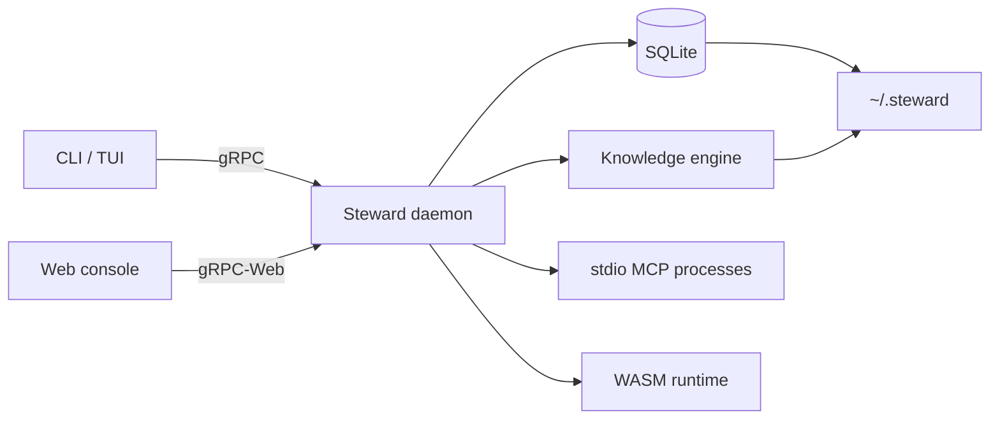
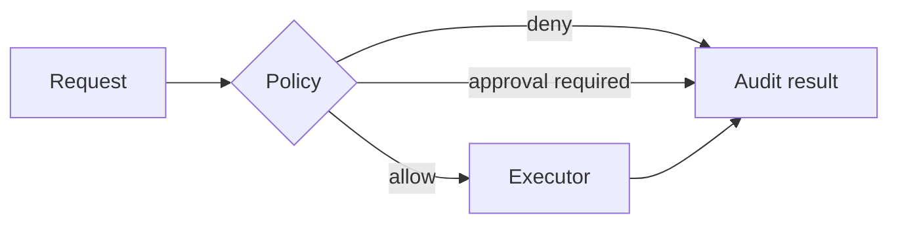

# Steward Architecture

## Goals

Steward is a compact, local-first agent operations runtime. Its architecture prioritizes durable state, explicit approval boundaries, portable user data, and a small deployable footprint.

## Runtime topology



The daemon binds to loopback. CLI/TUI and the optional web console are presentation clients; business policy and persistence remain in the daemon.

## Workspace boundaries

| Path | Responsibility |
| --- | --- |
| `crates/core` | Generated protocol types and shared storage-root resolution |
| `crates/daemon` | Workflow runtime, persistence, policy, audit, memory, MCP, maintenance |
| `crates/cli` | Commands, daemon auto-start, interactive TUI, archive import/export |
| `crates/knowledge` | Memory, graph, hybrid retrieval, nightly consolidation |
| `proto` | gRPC contract shared by Rust and the generated TypeScript client |
| `web-ui` | Optional Next.js operator console |
| `tests` | Real binary E2E, persistence, MCP, and portability scenarios |
| `scripts` | Release packaging and current-user Windows install lifecycle |

## Data ownership

All mutable application state belongs under `~/.steward` unless `STEWARD_HOME` explicitly overrides the root.

```text
~/.steward/
├── steward.db
├── config.json
└── memory/
    └── nightly/
```

SQLite stores workflows, workflow events, memory indexes, tools, skills, MCP definitions, and invocation audit records. Export/import archives the complete root and validates paths and database integrity before replacement.

## Workflow lifecycle

1. A client submits a workflow.
2. The daemon persists its initial state before starting the runner.
3. Each state transition and event is persisted.
4. Approval gates stop progress until an explicit decision arrives.
5. On restart, non-terminal and non-cancelled workflows resume from their persisted phase.

Terminal history is retention-managed; active or approval-waiting workflows are never pruned.

## Tool and skill governance

Every tool has a runtime kind, risk level, enabled flag, and approval requirement. Invocation follows one path:



Built-in and MCP tools share the same policy and bounded audit path. Skill bundles are Ed25519 self-signed: the signature protects bundle integrity without imposing a publisher allowlist.

## MCP lifecycle

Adapter configuration is durable; processes are not. The daemon starts an adapter only on explicit request, negotiates MCP over newline-delimited stdio JSON-RPC, discovers tools, and registers them as approval-required capabilities. Restarting the daemon leaves adapters stopped until the operator starts them again.

## Access policy

- The daemon listens on loopback only.
- gRPC-Web CORS accepts loopback browser origins only.
- Process execution and other high-risk capabilities are disabled unless explicitly implemented and enabled.
- External inputs are parsed at RPC, archive, skill, config, and protocol boundaries.

## Retention

`config.json` defines audit age and the maximum number of completed workflows. Maintenance runs during startup and through an explicit RPC/CLI command. The operation is transactional and removes workflow events before their parent workflow records.

## Distribution

The Windows release contains two stripped binaries, install/uninstall scripts, an example config, documentation, and a SHA-256 manifest. Installation is current-user scoped, adds the binary directory to the user PATH, optionally registers a logon Scheduled Task, and preserves `~/.steward` during update and normal uninstall.
